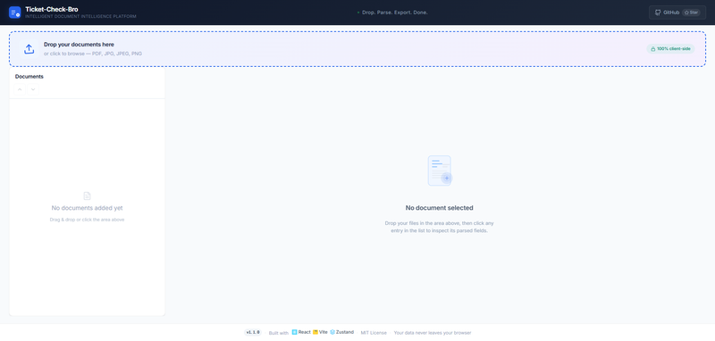
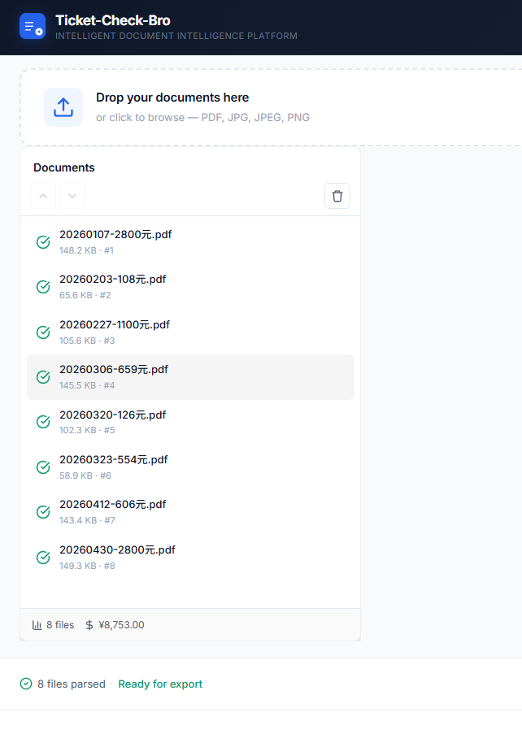
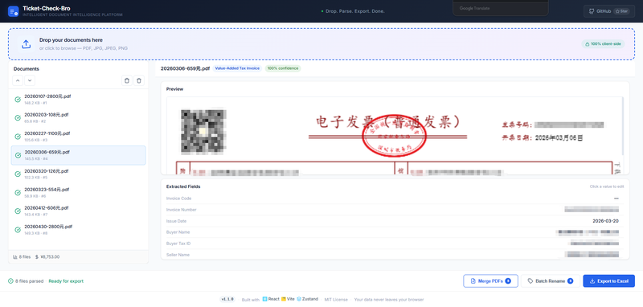

# Ticket-Check-Bro

[](https://ticket-check-bro.vercel.app/)
[](https://star-history.com/#bo-wu-feng-199/Ticket-Check-Bro&Date)
[](https://buymeacoffee.com/bo.wu.feng.199)

[](https://react.dev)
[](https://vitejs.dev)
[](https://github.com/pmndrs/zustand)
[](https://mozilla.github.io/pdf.js/)
[](https://pdf-lib.js.org/)
[](https://tesseract.projectnaptha.com/)
[](https://sheetjs.com/)
[](https://lucide.dev/)
[](https://pnpm.io)

> Intelligent Document Intelligence Platform — Parse invoices, receipts, and financial documents in your browser.

Upload PDFs and images — automatic document type detection, structured field extraction, spreadsheet export. **100% client-side. No server upload.** Supports Chinese & English invoices.

[⬆ v1.3.2](https://github.com/bo-wu-feng-199/Ticket-Check-Bro/releases) &mdash; 20 features, dark mode, i18n, PWA, responsive.

---

## Try It Now

👉 **[ticket-check-bro.vercel.app](https://ticket-check-bro.vercel.app/)** — no signup, no install, just open and drop your files.

<p align="center">
  
  <br/>
  <em>Upload, parse, and export — all in your browser</em>
</p>

<p align="center">
  
  <br/>
  <em>Drag-and-drop file upload with instant parsing</em>
</p>

<p align="center">
  
  <br/>
  <em>Extracted fields displayed in a structured card layout — click to edit</em>
</p>

---

## Capabilities

| Feature | Description |
|---|---|
| **Multi-format ingestion** | PDF, JPG, JPEG, PNG via drag-and-drop |
| **Dual extraction pipeline** | PDF text extraction (pdfjs-dist) + image OCR (Tesseract.js) |
| **8 document types** | VAT invoice, train/flight/taxi tickets, vehicle/fixed-amount/toll invoices, English invoices |
| **Schema-aware field recognition** | 8 specialized parser strategies |
| **Structured visualization** | Card-based detail panel with inline field editing |
| **Bulk export** | Unified spreadsheet download (.xlsx) via SheetJS |
| **PDF merge** | Combine multiple PDFs with per-page selection |
| **Batch rename** | Template-driven with variable chips + ZIP download |
| **Duplicate detection** | Content-aware hash comparison |
| **Drag-and-drop sort** | Reorder files for merge/export order |
| **Multi-select & batch delete** | Checkboxes + select all |
| **i18n** | Full Chinese & English UI |
| **Dark mode** | CSS variables, system preference detection, persistent toggle |
| **Keyboard shortcuts** | Ctrl+O (open), Delete/Backspace (remove), Ctrl+E (export) |
| **Session persistence** | Auto save/restore via localStorage |
| **Share screenshot** | html2canvas → clipboard + social share (Twitter/LinkedIn) |
| **Demo data** | One-click sample invoices |
| **PWA** | Installable, offline service worker |
| **Responsive** | Desktop / tablet / phone with iOS safe-area |
| **Privacy-first** | All processing in-browser, zero server upload |

### Supported Document Types

- Value-Added Tax Invoice
- Train Ticket
- Flight Itinerary
- Vehicle Invoice
- Taxi Receipt
- Fixed-Amount Receipt
- Toll Invoice

---

## Architecture

```
Layer            │ Technology                     │ Responsibility
─────────────────┼────────────────────────────────┼─────────────────────────────
Presentation     │ React 18 + Vite 5              │ Component tree, state, routing
State            │ Zustand                        │ Reactive store, derived stats
PDF Engine       │ pdfjs-dist + pdf-lib           │ Text extraction + page merge
OCR Engine       │ Tesseract.js (WASM)            │ Image-to-text via LSTM models
Parsing          │ Strategy Pattern × 8           │ Document-type-specific parsers
Export           │ SheetJS (xlsx)                 │ Spreadsheet generation
i18n             │ react-i18next                  │ Chinese & English UI
PWA              │ Service Worker                 │ Offline cache + installable
Icons            │ Lucide React                   │ Consistent SVG iconography
```

### Data Pipeline

```
Upload → FileHelper.typeCheck()
  ├── PDF → PdfExtractor.extract() → raw text
  └── Image → ImageExtractor.recognize() → raw text (async OCR)
               ↓
ParserFactory.detect(rawText) → matching strategy → parse(text)
               ↓
{ type, confidence, fields: { invoiceCode, issueDate, amount, ... } }
               ↓
Zustand Store → React Re-render → UI + Export
```

---

## Quick Start

```bash
git clone https://github.com/bo-wu-feng-199/Ticket-Check-Bro.git
cd Ticket-Check-Bro
npm install
npm run dev
```

Open `http://localhost:5173` — the app is fully functional in development mode.

### Build for Production

```bash
npm run build     # outputs to dist/
npm run preview   # preview the production build
```

---

## Deployment

Push to GitHub `main` branch — Vercel auto-deploys:

```bash
git add .
git commit -m "chore: update"
git push origin main
```

The Vercel project auto-detects the Vite framework. No additional configuration needed.

---

## Star History

[](https://star-history.com/#bo-wu-feng-199/Ticket-Check-Bro&Date)

---

## License

MIT — free to use, modify, and distribute.

---

*Built with precision. Powered by React + Vite.*
